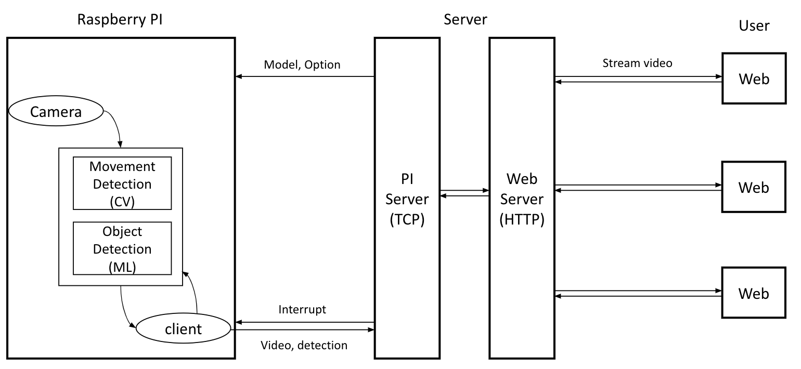
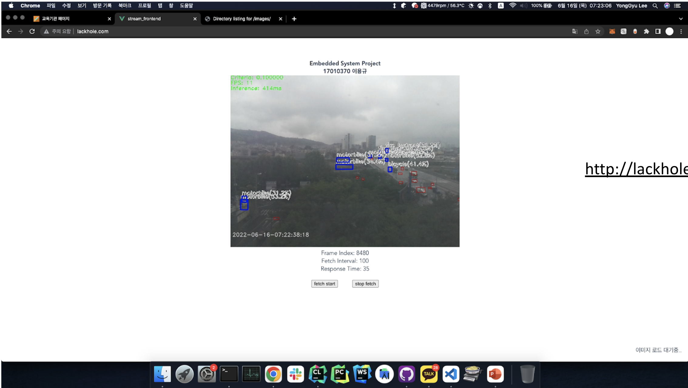

# Embedded System Project - Client

## Requirements
* CMake
* OpenCV
* C++ 17

## Support
* Raspberry PI
* macOS

## Structure
</img> 

## Demo
</img>
* The server is currently down due to budget.
